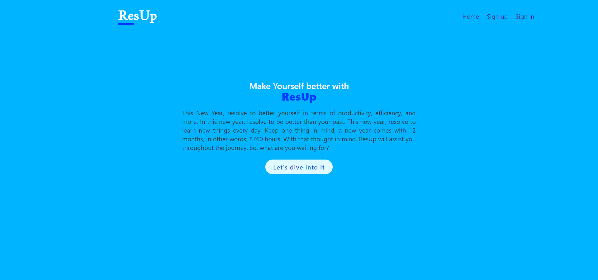
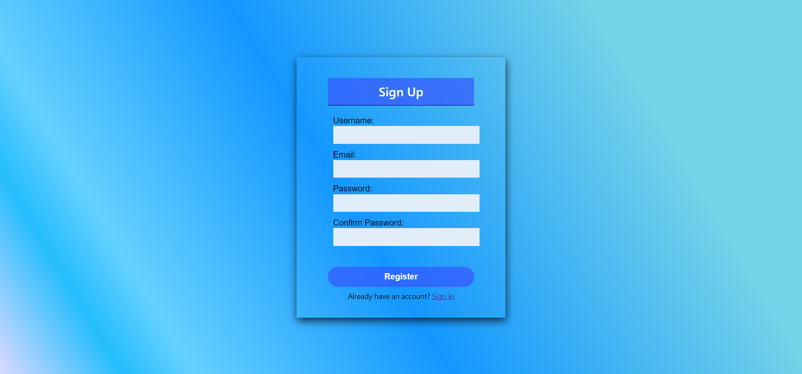
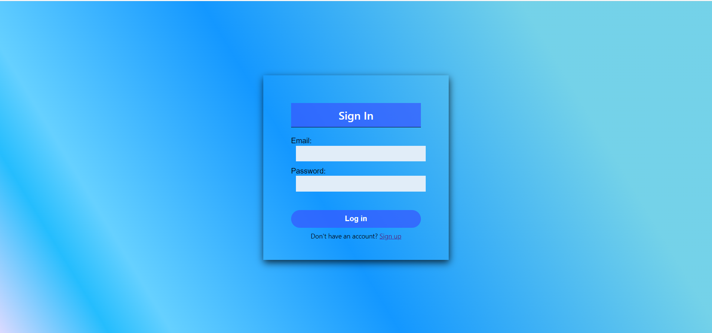
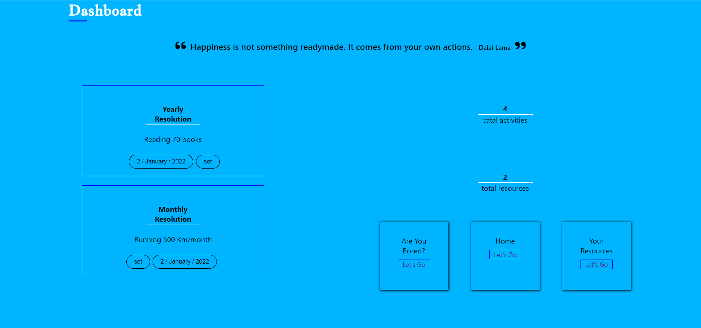
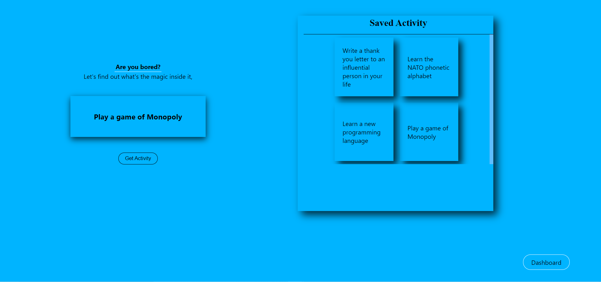
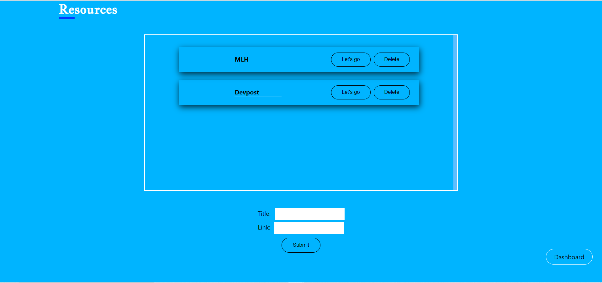

# ResUp - React App
React application 

# 🏗 Built with
- React.js

## 🏗 Setup 
1. Fork the repo by clicking the fork button
2. Clone the repo
```
    $ git clone https://github.com/your_github_username/ResUp.git
```
3. you need to install node_modules
```
    $ npm install
```
It's time to run the project
```
    $ npm start
```

# 📷 Screenshots
<br/>
<br/>
<br/>
<br/>
<br/>
<br/>
